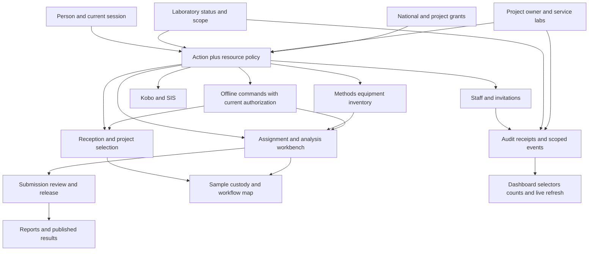

# Dependencies, ownership and migration

## 1. Relationship map

This is the target shared boundary; current code has the inconsistencies recorded in the findings. A lab service relationship grants work context, not permission to administer a project or its people.

## 2. Connection inventory and change requirements

| Surface / source | Dependency and verification |
|---|---|
| `server/routes/labRoutes.js`; `client/src/pages/admin/LabManagement.jsx` | Replace alternate staff logic with the same lifecycle service as Users; keep the dashboard configuration link; split picker/management responses |
| `userRoutes`, `userController`, `Users.jsx`, `UserDialog.jsx` | One role catalogue and target-policy implementation; safe self-profile; exact lab picker; preserve role/status/search filters in URL; manageable actions server-owned |
| `config/roles.js`, `AuthContext.jsx`, route/menu guards | Remove role-option drift and client fallback inconsistencies. Current server permissions win. UI refreshes on scope change. All ten role journeys remain tested |
| `authMiddleware`, `authController`, `wsServer`, `apiKeyAuth` | Reuse active account/lab, token version and impersonation actor validation. Close old sockets, protect original login return flow, same revocation semantics for SIS JWT |
| `projectRoutes`, `projectController`, `Projects.jsx` | Owner/service/member separation; canonical membership resolver for list/detail/stats/samples/manifest/creation/archive/restore/edit. Fix double response. Specific project link retains lab context |
| `koboRoutes`, `koboController`, project Kobo config handlers | The standalone lab config routes also rely on generic method permission and caller-provided lab ID. Add explicit target lab/project checks to config, form fields, sync sample/lab/all and configuration listing; no manager-triggered global sync. Media/proxy requests must resolve an authorized record rather than arbitrary cross-lab configuration. Verify exact handler behavior in staging; no live sync during audit |
| `sisRoutes`, `sisController`, `apiKeyAuth` | Correct global key-management exposure and missing labs on new keys. Keep the existing consumer denial for empty lab scope. Scope key list/revoke, constrain issuance, audit rotation, validate JWT revocation. Preserve published-result and spectral release boundaries. No claim of accreditation from a settings flag |
| `workItemController` assign/reassign/status/review; domain services | Same active eligible technician resolver for UI and API; source receiving lab is authoritative. Keep fixed order/method revision and historical authors. Emit events to resource lab, including admin/national actions |
| `resultEntryPolicy`, `workEligibility`, `operationalConfirmationService`, spectral services | Canonical prerequisites/checklists, result types, sealing, review and amendment. User transfer or project changes cannot bypass drying/prep or reinterpret spectral files as scalars. Management redesign must call these services, not rewrite scientific calculations |
| `offlineController`, `workPackService`, `syncService`, `SyncContext`, `offlineDb`, `syncEngine`, `workPackManager` | Bind work to user/device/lab/lease; no pack leakage or global no-lab fallback. Handle account switch/logout and revoked rights without losing drafts. Durable saves and receipts before APPLIED; use current authorization and original authorship |
| `equipmentRoutes`, equipment registry/events/eligibility controllers | Own-lab parent checks on all operations and event history; verify location/instrument references. Paused/retired lab lifecycle blocks operational changes but allows authorized historical read. Instrument status updates refresh method readiness |
| `inventoryRoutes`, `inventoryController` | Existing source ownership/transaction rules preserved. Validate destination location/lot/item/work references all belong to the appropriate lab. Inter-lab transfer not conflated with moving shelf location |
| `analysisController`, `cataloguePolicy`, `methodResolution`, LabMethods | Preserve whole-request validation and transactional defaults. A new default affects future orders only; existing work keeps its method snapshot unless an explicit supported change is reviewed. Display parameter names, not internal codes |
| `dashboardScope`, `dashboardService`, role dashboards | Fix unauthorized national selected lab and DST boundaries. Share management scope with queues and counts. Expected samples are not drying workload. Do not claim healthy/staff-free on load error |
| `adminController`, translation service, lab branding | Lab managers edit own-lab overrides only; global locale creation/deletion is separate. Preserve all five locales and theme preferences. Timezone change adjusts future local-day views, not stored timestamps |
| sample detail/map, reports, published SIS results | Access and historic ownership still resolve after staff/lab/project change. Sample page shows authoritative results; workbench remains the data-entry surface. Existing signed reports and method labels remain intact |
| Help v2 context router/content and offline Help | Add contextual guides for invitation, manager coverage, project access, recovery and unsynced work; update existing help IDs/route bindings. Do not roll back Help v2 or silently mark untranslated instructions complete |
| background workers, scheduled imports, cached directories, notifications | Use a server service identity and explicit resource scope; pause respects defined lab/integration policy. Enumerate workers during implementation. Scope changes invalidate cached capabilities; never broadcast private events globally to repair stale UI |

**Coverage distinction:** source and live evidence support the specific findings. This inventory also lists connected regression obligations (reports, complete worker/proxy flows and every screen) that have not been exhaustively exercised in this audit. Antigravity must complete and record those checks; their presence in this table is not a claim they passed.

## 3. Identifier dictionary — do not conflate these fields

| Field | Current meaning / migration rule |
|---|---|
| `Lab.id` | Laboratory identity, stable across contacts/name changes |
| `Lab.code` | Lab display/integration code; audit external references before any rename |
| `User.labId` | User home laboratory; currently unconstrained string. Resolve against Lab.id, never a sample ID |
| `Sample.id` | Internal/public route identity depending on existing alias resolver; preserve |
| `Sample.originalId` | Field/project sample identifier; preserve provenance and aliases |
| `Sample.labId` | Legacy/generated accession label in current schema and UI, sometimes overloaded; do not bulk convert to Lab FK |
| `Sample.assignedLab` | Receiving/owning laboratory used by current work assignment; authoritative once reconciled |
| `WorkItem.assignedTo` | Username relation to User.username; rename/archive strategy must preserve relational and historic authorship |
| `Project.id` / `code` | Distinct identities used by routes, samples, grants and integrations; keep an explicit resolver during migration |
| `ProjectLab` | Existing many-to-many service link; PRIMARY/BACKUP/OVERFLOW means service allocation, not automatically project administration |
| `Lab.projectCode`, `Project.labId`, `Project.assignedLabIds` | Legacy/display/owner-like relationships to reconcile; do not merge their union into grants blindly |

## 4. Read-only preflight report

Build an explicitly read-only command before a migration. Run on an isolated snapshot first. Production reporting uses a read-only connection/transaction and outputs no password hashes, keys, reset tokens or patient/client data. Produce counts plus restricted record-ID resolution files:

1. Active/disabled users by lab and role; unknown roles, duplicate normalized usernames/emails, orphan lab IDs, malformed countries/projects, ambiguous national scopes and users with no required lab.
2. Number of eligible super administrators, coverage per active lab, outstanding management invitations, available recovery channel. Establish at least one verified retained administrator before cutover; independent recovery access should be tested.
3. Labs missing country/timezone/contact/manager; distinguish legacy inactive from planned paused/retired. Identify users disabled as a possible historical lab cascade without guessing intent.
4. Four project relation sets, disagreements, dangling IDs/codes, junction-only projects, shared ownership ambiguity, restore-pool samples and orphan manifests.
5. Open work assigned to disabled/moved users; same-lab versus foreign-lab assignments; unassigned review queues. Include accepted/submitted attempts that must remain immutable.
6. Equipment/location and inventory lot/location cross-lab mismatches, unknown lab method references, missing readiness configuration. Reconcile references without inventing calibration or scientific approval.
7. Kobo configs grouped by lab AND project, duplicate/ambiguous records and health; SIS key lab scope/expiry/owner without secret values; background job owner scope.
8. Known offline packs and leases, owner/lab mismatch, unacknowledged devices; existing command receipts and draft persistence coverage. The server cannot enumerate drafts on disconnected devices—mark that as unknown.
9. Migration forecast: what each existing account/project can read/write before and after. Separate removal of accidental access from legitimate grant changes requiring a reviewed resolution.

Artifacts: `preflight-summary.json`, private `resolution-map.json`, exact baseline/schema hash, counters and referential constraints. No automatic cleanup of uncertain records.

## 5. Migration sequence

1. Snapshot database plus required uploads/media/config; verify restore to isolated environment. Inventory current deployed commit/schema and active workers.
2. Add nullable new columns/tables and indexes. Keep existing paths functional. Backfill only deterministic facts; quarantine ambiguous links in the resolution report.
3. Review mappings with a responsible administrator. For current labs, preserve operation state and identities. Do not suspend a whole lab solely because timezone is missing; flag setup attention.
4. Load explicit canonical relationships with source/reason and audit. Shadow compare scope outcomes without logging sensitive records. Reject unauthorized mutations immediately; shadow comparison is for legitimate compatibility, not allowing known bypasses.
5. Run constraints and before/after counts on samples, work items, attempts, submissions, reports, spectra, lots, users and projects. Sampling check includes historical accession labels and issued reports.
6. Switch readers via the shared resolver, then writers through one service. If temporary legacy-field mirroring is necessary, perform it transactionally in that service; no independent dual-write code in screens/controllers.
7. Release new staff/lab UI and migrate all pickers/deep links. Old privileged routes are adapters to the same authorization service or explicit retired-route errors; they cannot remain loopholes.
8. Close obsolete controls only after compatibility tests and confirmation that recent/offline clients have a safe path. Keep assets and offline schema adapters for the declared compatibility period.
9. Remove legacy relationships only in a later separately verified migration with zero remaining readers/writers. Keep restore data/history, not a destructive rollback.

## 6. Recovery and rollback

Application rollback must remain compatible with additive schema and keep access-control fixes. Do not restore old bypass routes. If data migration is wrong, stop affected administrative writes and use a tested forward repair based on the resolution map. Do not overwrite a database containing newly received samples with an old snapshot unless an explicit recovery procedure reconciles all later work.

For a bad scope change, an independent retained administrator reviews the audit and restores the intended grant with a new revision. For a paused lab, resume the lab; explicitly disabled staff stay disabled. For stranded work, preserve identity/evidence and reassign future responsibility with a new event. For offline rejected evidence, use an authorized recovery inbox and immutable original capture details, not automatic completion as another user.
