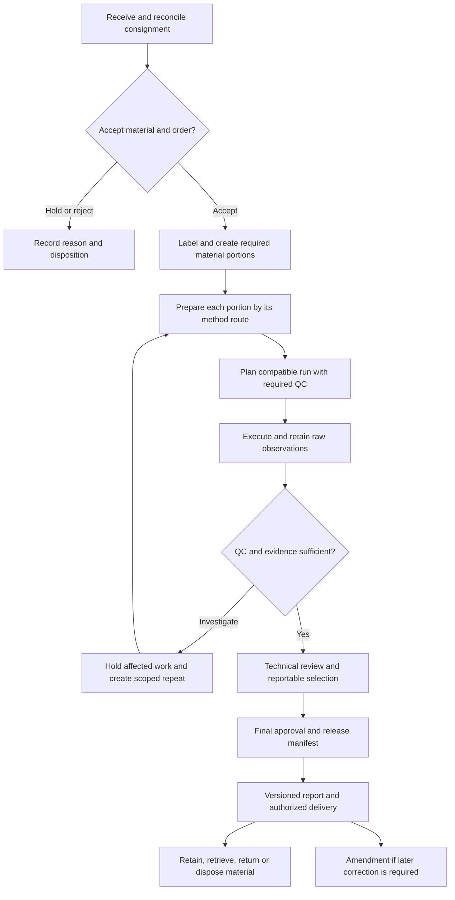

# Complete soil laboratory workflow implementation plan

**Scope:** routine soil fertility and soil characterization; **100–300 incoming samples/day**. Prepared 4 October 2026 against revision `878e894472708076228f590e58bd35ba2a8ecbfa`.

**Objective:** each reported determination can be traced from received material through preparation, execution, QC and review; technicians can operate physical trays efficiently; repeats remain scientifically interpretable; release cannot bypass missing evidence.

This is a proposed implementation design. [Findings](FINDINGS.md) identify verified current behavior. [Research](RESEARCH.md) provides the scientific basis and source-specific rules. [Acceptance tests](ACCEPTANCE_TESTS.md) define what must be demonstrated before rollout.

## 1. Decisions and assumptions

Retain the existing React/Express/Prisma application, reception controls, WorkItem/OrderLine/WorkAttempt foundations, equipment qualification, review decisions, and versioned report snapshots. Consolidate existing execution paths before adding new ones. Do not undertake a framework or database replacement as a prerequisite.

Use a **physical run workspace** for technicians and a **versioned evidence chain** for the server. An assignment queue tells people what needs doing; an execution worksheet records what is actually happening to labeled material in a tray or instrument sequence. The two views should be linked, with different purposes.

| Known | Planning assumption or decision still needed |
|---|---|
| Routine fertility and characterization | Exact method list and local SOP revisions are not supplied. Enable only approved profiles. |
| 100–300 incoming samples/day | Tests/sample, arrival peaks, staffing, shifts and instrument throughput remain unknown. |
| Existing workbench and QC modules | Preserve useful bulk entry/paste/conflict features and improve their scientific identity. |
| Existing equipment/inventory support | Confirm actual assets, balance connectivity, label printers and instrument file formats. |
| Existing lab scoping and external exchange | Keep laboratory/project restrictions and released-history compatibility during migration. |
| Soil testing includes different physical material needs | Fresh/field-moist tests, intact-core tests and spectral work are activated only where ordered and supported. |

Confirm during WP-00: local language/decimal convention, reporting units, adopted preparation methods, who reviews/releases, retention period, outage procedures, client turnaround promises, and whether any regulated/accredited reporting applies. These decisions configure methods; they do not delay the confirmed P0 repairs.

## 2. Non-negotiable system invariants

1. A customer sample keeps a stable accession identity. Labels distinguish original material, derived portions, extracts and controls.
2. Each ordered determination has a pinned method identity and revision. Execution never silently changes its method, unit, or material route.
3. Each physical execution has an attempt identity; its observations, actor, time and evidence are retained. Changing a reported number is not an ordinary overwrite.
4. Replicate identity describes **what was independently repeated**. Reanalysis after a failure is a separate attempt with a reason and parent link.
5. Every required control has an identity, coverage, expected occurrence and result. A count of QC types cannot establish adequate coverage.
6. Missing, pending, invalid and not-evaluable QC are different from passing QC. “Not applicable” requires an approved method rule.
7. Physical capacity includes unknown portions, independent duplicates and control portions. A duplicate reading that uses the same vessel need not consume another physical slot.
8. A technical reviewer sees all relevant attempts and QC exceptions. Reportable selection follows an approved rule; failed results cannot disappear through repetition.
9. All write paths enforce laboratory/role scope, current versions and the same scientific transition rules. UI visibility is not authorization.
10. Final release is an immutable manifest of approved selections and their evidence revisions. Publication and external delivery reference that manifest.
11. Corrections, amendments and disposals preserve prior scientific/report history. Physical storage state does not rewrite analytical status.
12. Missing historical lineage is identified as unknown. Migration never invents a method revision, calibration, material lot, QC result or reviewer.

## 3. End-to-end target workflow



### 3.1 Request, consignment and reception

Reception starts from an expected manifest where available. Reconcile received containers, field/client identifiers and requested services without replacing the field ID with an internal number. Preserve collection date/depth/location when provided, condition, receipt time/person, quantity, packaging, leakage/damage, and requested deadline. Record missing facts as missing, rather than fabricate defaults.

Generate a barcode for the accession and distinguish labels for containers/portions. Reprints must retain identity and be auditable. Duplicate scans show the existing record; they must not create a second sample. Support bulk intake with a preview of additions, duplicates and discrepancies.

Each requested service resolves to an OrderLine with laboratory method revision, required/optional status, reporting unit/basis and preparation route. If a package changes, append an order revision with added/cancelled lines; do not mutate completed work invisibly. A client asking for “phosphorus” needs a locally defined service choice, not an arbitrary generic P method.

Accept, accept with a documented limitation, hold, or reject each sample/portion as appropriate. A manager-approved partial order handles insufficient material. Holds carry a reason, responsible person, affected lines, next action and resolution history. Reception observations can be recorded while work remains blocked.

Mass planning should count unique preparation/extraction groups, quality duplicates, planned repeat reserve and retained material. A shared extraction for several analytes should not consume the same input mass several times on paper. Actual measured available/consumed quantity supersedes an estimate, with units and uncertainty appropriate to the operation.

### 3.2 Portioning and preparation

Introduce traceable physical portions linked to their parent: as received, routine prepared fine earth, method-specific finer material, intact core, retained portion, extract/digest, dilution and QC material portion. Not every sample needs every branch. A barcode can identify a container; the material and its location remain separate records so transfers are explicit.

The route derives from the method's requirements. Routine dried/sieved soil can feed compatible fertility tests; tests requiring fresh material or intact structure need another branch. Use approved local procedures for preservation, temperature and permitted delays. Do not hardcode one drying temperature or one holding time across tests.

At a preparation station, record a batch operation once for all selected compatible portions: apparatus, operator, start/end, relevant conditions, method checklist and exceptions. Attach per-portion differences where necessary. The UI must allow a single damaged or insufficient portion to be held without forcing all neighbors into the same state.

Record cleaning/contamination controls where the preparation SOP requires them. Preserve coarse fraction information and actual portion yield when relevant. Link grinding/sieving dimensions to the method and material; do not use a free-text “fine earth” string as the only evidence. Failed preparation blocks affected descendants and creates an investigation; unaffected sibling portions retain their own eligibility.

### 3.3 Planning work, trays and instrument sequences

Offer a planning queue filtered by lab, station, method revision, material readiness, due date, priority, instrument and hold reason. Count incoming samples, ordered determinations, physical positions and repeats separately.

Create a preparation/extraction batch when portions undergo the same controlled preparation operation. Create an instrument run/sequence for measurement. A physical tray may move between stages; it is not necessarily identical to either batch. Permit one extraction to feed multiple analytes/runs when the approved method supports it, with explicit links.

A planner proposes compatible work and required control instances. Show **unknown positions + duplicate positions + other QC positions + spare positions = capacity**. Warn about short control-material stock before run start. Enforce reserved positions, range limits and uniqueness on the server, including concurrent allocation. An explicit transfer records both old and new occupancy before execution; after execution begins, preserve the run record and use a new attempt where necessary.

Freeze the run plan at start: method and QC revisions, layout, required controls, asset and applicable calibration/qualification evidence, reagent/control lots, analysts and planned sequence. Changes after start append an amendment and re-evaluate coverage. A late-added sample must not inherit QC that never covered it.

### 3.4 Execute, save and hand over

Provide method-specific stages such as weigh, add extractant, equilibrate/shake, measure and calculate. Only show fields required by that method. A pH worksheet and a texture worksheet should share navigation and evidence controls without pretending that their records are identical.

Capture raw instrument readings and actual masses/volumes before calculated results. Preserve raw input precision; round only at the configured reporting step. Link instrument file, balance observation or manual entry with author/time. Record overrides as corrections with reasons.

Drafts can be saved while a prerequisite is pending, but are visibly ineligible for completion. Define separate transitions for saved draft, execution complete, submitted for technical review, accepted determination and released result. A technician can finish entry and move to another tray while the run is waiting for final control readings.

Shift handover shows current positions/stages, started timers, pending readings, instrument condition and outstanding exceptions. Ownership transfer does not attribute one operator's observations to another. A station/device is not a shared user identity.

### 3.5 QC, failure, investigation and repetition

The engine checks required occurrences, valid observations and coverage before calculating acceptance. A failed control identifies affected attempts/analytes/run segments and places a release hold on that set. It must not indiscriminately reject every test ordered on the customer sample.

The quality reviewer records suspected cause, investigation, corrective action, required repeat scope and final disposition. Options include repeat control, re-read an extract, dilute/re-read, re-extract, re-prepare, recollect material, or release with a documented qualification if the approved policy permits it. Repeating only a control must not automatically validate measurements made during the failed interval.

When later QC evidence casts doubt on released results, create a nonconformance/impact record and identify the report versions and exchange deliveries involved. Keep the published history; decide amendment/withdrawal/notification through the authorized process. Do not silently edit old reports or automatically send client messages.

### 3.6 Review, approval and delivery

The reviewer works by run or submission with an exception-first summary, then can inspect sample-level evidence. Show method/revision, original and repeat attempts, QC coverage, result flags, calculations, material/instrument exceptions and proposed reportable selection. Allow efficient bulk acceptance only where each selected item independently passes the same server predicate.

Final approval verifies completion or authorized omission of every required active order line, accepted selections, applicable QC, current holds, and report context. Authorized omissions appear in the report; they must not be confused with an undetected missing result. Partial reports require an explicit partial-release policy and clearly identify outstanding tests.

Generate a report snapshot from the release manifest. Include unambiguous method identity, units, relevant basis, qualifiers, report version and actual approving person. Keep analytical findings distinct from optional agronomic interpretation. Interpretations need a compatible method/region/crop calibration and a rule version; unsupported combinations should be visibly unavailable. Censored results are not exact threshold values or zero.

Shares, exports and external exchange use the same release version and existing access restrictions. Amendments reference the prior report and explain changes. A changed upstream result does not cause old share links to display silently recomputed content. Decide explicitly whether a link resolves to its original version or to a version history/current-version page.

### 3.7 Retention, retrieval, return and disposal

Track storage location, material state, remaining quantity and retention deadline per portion. Keep reporting/approval state separate. Record movements between bench, storage and another lab; preserve custody and transfer receipts.

A stored portion can be retrieved for an authorized new attempt. Disposal is allowed after retention requirements and active holds are satisfied, including after archival storage; require actor, date, quantity, method and any required authorization. Returning material to a client is a separate disposition. These actions do not delete reports, raw results or evidence. Do not hardcode retention periods until local agreements and obligations are configured.

## 4. Technician workbench specification

### 4.1 Three main work views

| View | Technician's purpose | Required content |
|---|---|---|
| Work queue | Find or plan the next job | Station/method filters, readiness reason, priority/deadline, tray suggestions, personal/team assignment. |
| Active run | Perform work at the bench | Stable physical position order, sample/control identity, current stage, relevant inputs, timers, saves and QC coverage. |
| Handover/review readiness | Finish the shift or submit evidence | Saved/unsaved/conflicted counts, incomplete controls, blocked items, repeat requests and submission receipt. |

Retain accessible single-sample entry for genuine one-off work. A run can contain a single unknown plus required controls; the model must not require filling a tray.

### 4.2 Proposed focused layout

```text
Tray PH-104  |  Method + revision  |  Asset  |  Analyst  |  Online / saved time
Unknowns 34  •  Controls 6  •  Needs attention 2           Scan container [     ]
Stage: Prepare / Equilibrate / Measure / Finish          Timer / instructions

Pos  Type       Container / sample     Reading       QC or entry state
01   Control    SOIL-C2 / bottle 07    [       ]      awaiting measurement
02   Unknown    LAB-001 / portion B    [       ]      saved 09:42:18
03   Duplicate  LAB-001 / portion C    [       ]      linked to position 02
... fixed physical order; controls remain visible and clearly labeled ...

Saved 28/30 • 2 pending sync • 0 conflicts       Save / Review completion
```

The example is a layout concept, not a prescribed pH sequence or approved QC plan. Generate actual positions from the selected policy and tray profile. Keep a compact run header, collapsible main navigation, optional details drawer, sticky table headings and a visible completion bar. Do not force the technician to scroll a hundred assignments to reach the active tray's actions.

### 4.3 Keyboard, scanner and bench handling

- Enter/Tab advance predictably to the next editable field; Shift reverses direction. Focus and selection must be obvious. Test these behaviors in the actual browser; retaining code is not evidence that navigation works.
- A scanned code resolves sample/portion/control/run identity. A wrong tray or unexpected duplicate produces a recoverable warning before associating data. Repeated scanner suffixes must not double-submit.
- Keep physical order stable while typing, saving or receiving remote updates. Do not auto-sort a just-completed row away. Show newly arrived work in a separate notice.
- Support large touch targets, high contrast, non-color status cues, magnification and keyboard-only use. Aim for 44–48 CSS-pixel frequent controls in touch mode; compact keyboard mode can use a denser grid. See research R12.
- Provide a printable labeled rack map/worksheet for the lab's approved outage procedure. Re-entry later captures original operator/time and transcription verification.
- Keep the computer interaction compatible with gloves and contamination control. Test a wipeable keyboard/scanner or other locally selected equipment at the actual bench; software cannot determine the appropriate hardware placement alone.

### 4.4 Saving, outages and concurrent users

Show states per row: edited locally, saving, saved to server at time/version, failed, and conflict. A global “saved” badge is true only if every relevant edit is acknowledged. Do not acknowledge completion on a timeout with an unknown outcome.

Use idempotency keys for batches/imports/submissions and optimistic revisions for edited rows/attempts. On conflict, compare both versions without overwriting the other person's work. Preserve unsubmitted input across navigation according to the site's storage policy. Offline draft storage is a feature to implement and validate, not an assumption that the current application is offline-capable.

Offline mode, if approved, permits clearly labeled local draft capture, not offline scientific release. On reconnect revalidate method/assignment/hold/QC versions and resolve conflicts. Do not store unnecessary client-identifying information on a shared station. Handover and session lock must not lose acknowledged drafts.

### 4.5 Throughput design

Incoming samples are not equivalent to determinations. With an **illustrative eight ordered determinations/sample**, 100–300 incoming samples produce 800–2,400 primary determinations before repeats/QC. Ten avoidable seconds per determination would consume roughly 2.2–6.7 operator-hours/day. This is arithmetic for prioritizing interactions, not a staffing estimate.

For an illustrative 40-position sequence applying the EC count rules in research R03, with two control positions and `ceil(0.10 × unknowns)` independent duplicate positions, solve `U + ceil(0.10U) + 2 <= 40`: **34 unknowns** fit. If a different approved method additionally requires one blank in that same sequence, **33** fit. This is a proposed conservative rounding rule; the local policy must define frequency rounding and final short batches. Extra calibration/bracketing controls may reduce capacity further.

At 34 unknowns, 100 and 300 samples require 3 and 9 runs for that determination before repeat work. The current generic four-slot rack instead holds 36 unknowns, but that does not prove compliance with any particular method. Plan instrument time, preparation time, stabilization periods and control stock independently. A shared multi-analyte extraction reduces physical work without making QC outcomes interchangeable between analytes.

Use workload views for queue age, due work, preparation capacity, instrument downtime and QC holds. Measure first-pass completion, repeats by cause, time waiting for review, and time spent entering data. Avoid targets that discourage recording failed attempts.

## 5. Scientific identities, replicates and repeat rules

### 5.1 Terminology stored in the system

| Concept | Meaning and identity | Reporting behavior |
|---|---|---|
| Customer sample | Submitted field/material unit, with accession identity. | One or more requested services; may have multiple reports. |
| Field duplicate | Separate collected sample paired for sampling QC, possibly blinded. | Separate accession; pairing can remain restricted until evaluation. Not a second lab reading. |
| Preparation duplicate | Separate portion independently subjected to the specified preparation stages. | Pair links the stage and material parents; estimates that stage's combined variation. |
| Analytical duplicate | Independent test portion/extraction for the same method as defined by its SOP. | Linked unknown/duplicate pair, not two unlinked typed numbers. |
| Instrument replicate | Repeated measurement of the same prepared solution/material. | Readings within an attempt; does not prove preparation precision. |
| Repeat attempt | A new execution to resolve failure, out-of-range measurement, equipment interruption, or another reason. | New attempt number and parent/reason; original evidence stays visible. |
| Correction | Amend an entry/import/calculation mistake with evidence and reason. | New revision; invalidate affected review/release eligibility as appropriate. |
| Reportable selection | Authorized choice or approved reduction of accepted observations for one order line/analyte. | Exactly what the release snapshot reports, with all contributing IDs. |

Do not automatically average all numbers named “replicate.” Configure whether the method reports a primary value, a mean of specified valid independent replicates, a defined instrument reducer, or separately reported determinations. Store contributors, unrounded reducer output, rounding rule and reviewer. A failed initial result cannot be diluted into a passing average by adding a convenient repeat.

### 5.2 Repeat request dialog

Start from the affected row, analyte, extraction group or QC incident. Show the source attempt and proposed scope before confirmation. Require a reason code, optional explanatory note, and the requested level: re-read same material; new dilution; new extraction; new preparation; new field sample. Collect technical approval according to the lab's policy rather than demanding manager approval for every harmless draft correction.

Create the new attempt and needed child material(s) atomically. Inherit only valid unchanged context, pin the intended method, and recheck equipment and applicable QC for the new run. Reserve sufficient material and controls. Make unavailable/depleted material a visible blocker with a suggested next action.

Example: P and K came from one extract, but only the P check fails. Investigate and hold the P determinations covered by that check. If the failure is shown to affect extraction itself, widen the hold to all affected analytes. A repeat request should allow P-only re-reading or a fresh shared extraction as justified; it must not automatically repeat pH, texture and every other test on those samples.

Review shows all attempts chronologically, reasons, QC and selected output. Choosing a repeat requires an accepted disposition of the prior attempt. Preserve the rejected/invalid attempt and its measurement; do not remove it from the audit or relevant failure statistics.

## 6. Method-specific QA/QC specification

### 6.1 Controlled policy

Create a versioned QcPolicy attached to laboratory, MethodRevision, matrix/material class, analyte or analyte group, reporting unit/basis and validated range. Policy states are draft, approved, retired. Only an authorized method owner/quality role approves scientific settings; a technician cannot lower a limit while entering a result.

Each rule declares control type, applicable stage, frequency/count/rounding, placement or time/bracket constraints, source/target material, calculation, limit source, outcome severity, affected scope and allowed actions. Pin the revision at run start. If a policy is missing, display “QC policy not configured” and block release of affected determinations; do not substitute the current generic constants.

Use independent outcome and lifecycle fields. Outcomes: MISSING, PENDING, PASS, WARNING, FAIL, NOT_EVALUABLE, NOT_APPLICABLE. Lifecycle: planned, active, complete, closed/cancelled. A qualified release can be authorized under a suitable policy while retaining the original WARNING/FAIL and qualification; it must never relabel failed QC as PASS. Missing evidence cannot be waived by an unrestricted generic “proceed” button.

### 6.2 Control catalogue and coverage

| Control | Required identity and purpose |
|---|---|
| Calibration material | Lot, assigned concentration/value, units, preparation/dilution and calibration event. Used to establish the response. |
| Independent check standard | Separately identified source/lot as required by the method; evaluates the calibration independently. |
| Certified reference material | Certificate, property/method applicability, value, uncertainty and valid use conditions. Certification is property-specific. |
| Other reference material / PT material | Provider, assigned-value basis and method group; never automatically labeled certified. |
| In-house control soil | Preparation, homogeneity/stability evidence, bottle/lot, method-specific target and approved chart limits. |
| Reagent or method blank | Exact blank type and stages followed; analytes, unit, correction rule and covered preparation/run. |
| Carryover/calibration blank | Defined sequence position and relevant prior/following measurements. |
| Duplicate | Source sample/portion and paired independent execution or reading, with the repeated stage explicitly recorded. |
| Spike/recovery control | Parent material, spike solution/amount and calculation where required by the local method. Not mandated for every fertility test. |

Create planned control instances before entry, with stable IDs and physical occupancy where applicable. QC coverage is a relation to specific attempts/analytes or a defined ordered/time interval. Store it explicitly or as a reproducible frozen manifest. A control measured after an interruption cannot automatically cover an earlier failed segment.

### 6.3 Calculations and scientific edge cases

Use absolute differences for appropriate properties such as pH and validated relative or mixed criteria for applicable concentration ranges. The cited method-specific examples are in research R02/R03. Do not repeat their numeric rules as universal defaults elsewhere.

For RPD, define applicability before dividing: both measurements must be eligible quantified values in compatible units/basis; near-zero/negative/censored cases use the approved absolute/mixed rule or become NOT_EVALUABLE. Equal zeros are not evidence of precision without a method-specific basis for that decision. Validate numeric finiteness and plausible domain separately from QC acceptance.

Keep detection/quantification qualifiers as structured fields: measured value, qualifier, applicable limit and limit source. Do not convert `<LOQ` into LOQ or zero for recovery, averaging or agronomic interpretation. Dilution and basis conversion must transform applicable limits consistently. Do not let rounding create a false pass at the boundary; define whether comparisons use unrounded values.

Control charts need approved target/limits, method/material lot identity, revision, effective period and sufficient characterization evidence. Keep original and corrected points with exclusion reasons; record whether a point participates in limit estimation. Use a defined rule set inspired by the current handbook, not every possible chart alarm simultaneously. Do not continuously refit limits so that a drifting process appears acceptable.

### 6.4 Method onboarding matrix

These are configuration requirements, not confirmed services in this particular lab and not complete wet-lab SOPs.

| Method family | Required distinguishing context | QC/calculation design emphasis |
|---|---|---|
| pH | Water/KCl/CaCl2, ratio, portion preparation, meter/electrode and temperature/calibration context. | Absolute differences; method-matched soil control; buffers separate from soil QC. |
| EC | Extraction/suspension ratio, temperature compensation/reference, cell and unit. | Method count/coverage and check materials; no generic cross-ratio interpretation. |
| Available P | Olsen/Bray/Mehlich or actual adopted method, extractant, ratio, detection technique. | Blank/check soil/duplicates as specified; extraction and measurement coverage; interpretation tied to method. |
| Exchangeable bases / CEC | Extractant, pH and procedure; measured versus calculated outputs. | Shared extraction with per-analyte QC; derived values require accepted contributors. |
| DTPA or other extractable micronutrients | Actual extractant/revision, detection instrument, range/dilution. | Low-level/censored behavior, contamination/carryover and individual analyte failures. |
| Total/organic carbon and nitrogen | Combustion, wet oxidation, Kjeldahl or other defined method; carbonate pretreatment if applicable. | Actual masses, blanks/control material, calibration and formula; no universal carbon-to-organic-matter factor. |
| Moisture / loss on ignition | Weighing stages, tare, time/temperature/end-point procedure. | Traceable mass differences and repeated weighing rules; moisture correction distinct from sample preparation. |
| Particle size / texture | Hydrometer/pipette/other procedure, pretreatment, readings, time, temperature and corrections. | Raw calculation lineage, fraction sum/tolerances and texture-system version. |
| Bulk density / physical characterization | Intact or other specified sampling geometry, mass/volume and coarse-fragment treatment. | Preserve structure/geometry and applicable calculation; never force routine grinding first. |
| Mineral N / other sensitive tests, if offered | Local preservation, material condition and permitted delays. | Separate route, timestamps and stability limits; do not borrow routine air-dry assumptions. |
| Spectroscopy, if offered | Scan identity, raw file, instrument/reference checks, model version and applicability. | Distinguish measured spectrum from predicted property; prediction uncertainty/validation and accepted model lineage. |

## 7. Data and service architecture

### 7.1 Extend existing entities deliberately

Names below are proposed logical entities; Codex should map them to existing models and migrations before creating tables.

| Entity | Implementation direction and invariants |
|---|---|
| Sample / SampleOrderRevision / OrderLine | Retain. Pin actual method revision and required reporting intent. One active order revision; cancellations/omissions explicit. |
| MaterialPortion / MaterialMovement | Add normalized portion ancestry, condition/fraction, container, quantities/units, location, preparation records, retention/hold/disposition. Enforce acyclic ancestry. |
| MethodRevision | Reuse/extend method catalogue revision concepts. Immutable approved execution template, calculations, preparation requirements, report rules and QC policy reference. |
| WorkItem | Retain as assignment/planning projection. Avoid using its single result string as scientific authority. Derive status from current attempt/review evidence. |
| WorkAttempt | Extend existing model for every execution: order line, attempt number, parent/reason, material, method revision, actor, run, status, evidence revision. Unique per order-line attempt sequence; allocate atomically. |
| Measurement / Result | Decide whether existing Result can represent typed observations plus computed outputs. Add attempt/replicate identity, qualifier, raw versus calculated role, source hash, method/basis/unit, supersession. No independent competing current flags. |
| ReplicateGroup | Store purpose/stage, linked members, metric, rule revision and reporting reduction. An instrument repeat is not an independently prepared duplicate. |
| Batch / Run / RunPosition | Evolve current Batch with explicit stages/relations. Normalize membership and control occupancy; unique active `(runId, position)`. Freeze executed sequence. |
| QcPolicyVersion / QcInstance / QcObservation / QcEvaluation | Separate requirements, physical controls, immutable measurements and versioned outcome. Record target/limit provenance and coverage. |
| InventoryLot / ControlAssignedValue | Retain inventory lots; add method/property-specific assigned values/certificates/stability/quantity links. Snapshot relevant attributes at use. |
| EquipmentAsset / Qualification / CalibrationEvent | Reuse. Bind actual eligible asset and qualification/calibration at execution; later expiry does not retroactively erase a historically valid event. |
| RepeatRequest / Nonconformance / Disposition | Link affected attempts/analytes/reports, reason, investigation, corrective action and authorized decision. |
| ReviewDecision / ReportableSelection | Retain decisions; bind reviewed evidence revision and selected contributors/reducer. Unique active selection for an order-line/analyte reporting context. |
| ReleaseManifest / Report / SampleAmendment | Add or extend snapshot identity covering order revision, selections, QC evaluations, reviewer and holds checked. Preserve existing report versions and amendment chain. |
| AuditEvent / Outbox / IdempotencyReceipt | Reuse available infrastructure or add narrowly. Command transaction includes audit and durable event intent; external effects happen after commit. |

Keep lab ownership on all relevant entities and validate relationships share authorized scope. Use database foreign keys and unique constraints where possible; transactional service rules enforce the remaining invariants. For SQLite conditional uniqueness, choose a supported migration strategy and test it; do not rely on UI checks or assume ORM declarations cover partial indexes.

### 7.2 Shared command services

Consolidate services for intake/order amendments, material operations, run planning, attempt recording, QC evaluation/disposition, review, and release. Controllers and compatibility routes are adapters to these commands, not independent policy implementations.

Every mutation accepts the intended entity revision and a request/idempotency key where retries could duplicate work. Validate authorization, scope, relationship integrity, transition and evidence in the same transaction as the write. Return a structured result containing new versions, saved/blocked items, reasons and receipt ID. Do not show a batch operation as wholly successful if only some rows persisted.

Return machine-readable blocker codes with human explanations and links to resolution. Differentiate a validation error, forbidden action, stale version, missing configuration, and transient failure. Audit actor, original occurrence time where supplied, server record time, reason and correlation ID. Avoid putting unnecessary personal or sensitive data in logs.

Use a single release eligibility service from canonical and older review/report/publication paths. Submission can be allowed with pending QC if explicitly queued as waiting; acceptance/release remains blocked until policy conditions hold. Compatibility routes must not relax this distinction.

### 7.3 Read projections and performance

Return run/attempt-specific data to the worksheet. The global queue uses cursor pagination, indexed filters and counts with well-defined semantics. Virtualization must preserve accessible focus and stable row keys. Avoid rendering thousands of hidden inputs or issuing a result query per row.

Useful indexes include authorized lab plus status/due date, order-line attempts, run positions, current selection, material ancestry/active location, and QC coverage lookup. Measure realistic query plans and SQLite lock behavior before proposing a database migration. Define paging consistency and counters during concurrent updates.

### 7.4 Instrument import and calculations

Version import mappings by instrument/export format. Preview sample/portion/run matches, unknown IDs, duplicates, unit mismatch, missing controls and overflow before committing. Match by stable identifier; row order is allowed only against a frozen signed-off sequence with explicit reconciliation.

Retain original files with hashes and access controls, parser/mapping version, source row and accepted values. Reimporting the same file/request is idempotent; a deliberately corrected file creates a new evidence revision. A multi-analyte file can have a partial analyte failure without losing all valid observations, while release remains scoped correctly.

Calculation records reference raw masses/volumes, extractant volume, dilution factor, blank treatment if allowed, moisture factor if applicable, formula version and units. Unit normalization cannot by itself convert solution mg/L into soil mg/kg; the preparation amounts are part of that calculation. Verify dimensional consistency and preserve original unit/value alongside normalized outputs.

## 8. Implementation work packages

Each package should be a reviewable change set with tests and updated progress evidence. Size labels are relative engineering scope, not calendar promises. Split large packages into several PRs rather than delivering one major rewrite.

| Package | Scope / size | Dependencies | Principal findings |
|---|---|---|---|
| WP-00 | Inventory, isolated fixtures, method decisions / S–M | None | F26, local decisions |
| WP-01 | Release/QC containment / M | Minimal WP-00 fixture | F01–F08, F11, F21 |
| WP-02 | Canonical attempt and result identity / L | WP-01 | F09–F10, F13, F18–F19 |
| WP-03 | Material routes and quantity/retention identity / L | WP-02 contract | F14–F15, F23 |
| WP-04 | Normalized runs, positions and capacity / M–L | WP-02; WP-03 links | F11, F13, F16 |
| WP-05 | Method QC and control materials / L | WP-02/WP-04 | F03–F08, F12, F24 |
| WP-06 | Practical technician workspace / L | WP-02/WP-04 contracts; integrate WP-05 | F10, F16–F18 |
| WP-07 | Import, calculations and qualification evidence / M–L | WP-02/WP-03/WP-05 | F08–F09, F15, F24 |
| WP-08 | Scoped repeats and selection / M–L | WP-02/WP-03/WP-05 | F09–F10, F18 |
| WP-09 | Review, release and amendment integration / L | WP-05/WP-07/WP-08 | F01–F02, F06, F20–F21 |
| WP-10 | Retention, retrieval and external delivery / M | WP-03/WP-09 | F22–F23; exchange compatibility |
| WP-11 | Charts, PT and quality improvement / M | WP-05/WP-08/WP-09 | F25 |
| WP-12 | Migration rehearsal and operational pilot / M + lab time | Continuous; final gate after core packages | All |

### WP-00 — Establish the baseline and method inventory

Inventory current routes, statuses, models and existing tests before editing. Re-run the supplied synthetic probes against the actual implementation branch; older work plans are context only. Create a clean schema/fixture test database without copying operational records; isolate teardown paths. Record build/test baseline and existing unrelated failures.

Produce an approved-method configuration worksheet for the first pilot (suggest pH and EC only if those are actually offered), one extraction-based nutrient method next, and a characterization method after that. Map roles and physical stations with at least a reception operator, two technicians and a reviewer where available. Exit: actual source-of-truth mapping, representative instrument sample files with non-sensitive IDs, and a prioritized local decision log.

### WP-01 — Contain confirmed integrity defects

Repair or retire the legacy review endpoint; enforce publication after valid final approval; reject pending/missing QC for acceptance. Remove prefilled QC measurements and fake asset defaults. Use the common scientific parser. Validate every required control instance in supported current profiles. Fix evaluation/closure using the proposed state, make QC persistence atomic, and reject or explicitly transfer already allocated work.

Do not wait for the full new architecture to close these holes. Where the current schema cannot establish complete evidence, return an explicit blocker and an actionable message. Preserve existing valid null/closed/direct-pass safeguards. Exit: P0/P1 counterexamples become meaningful regression tests, all route aliases use the same rules, and no created report survives a failed release.

### WP-02 — Complete execution identity

Map active OrderLines to attempts, then link every numeric, texture and spectral recording path to the canonical command. Define current selection, supersession and attempt numbering before migration. Replace fallback “rev1” with pinned or unknown lineage. Add draft identity that can hold multiple independently identified attempt/replicate drafts. Keep legacy result fields as read projections during compatibility, not competing authorities.

Exit: two methods or two replicates for one sample cannot overwrite or ambiguously display each other; every newly recorded result has execution provenance; partial retries cannot create duplicate attempts.

### WP-03 — Model physical material and readiness

Add portions, preparation operations, location movements, quantities and method routes. Adapt reception planning and existing operational tasks/checklists. Make readiness compute from the required portion route, equipment and current holds. Add traceable moisture/basis calculation inputs. Do not require replacing all historical sample records before new samples can use the model.

Exit: one sample can provide routine prepared soil and a separately handled required portion; a problem in one branch affects exactly its dependent work; remaining quantity is reconciled.

### WP-04 — Make run planning physically correct

Normalize batch membership and positions; add method/asset/policy compatibility and preparation-to-measurement links. Generate controls/capacity from approved policies. Add a transactional allocation/move/start flow and a rack-map print view. Preserve frozen layouts after execution. Migrate conflicting membership into a visible reconciliation queue rather than arbitrarily choosing an old JSON list.

Exit: no double occupancy or silent transfers under concurrent requests; required QC fits the physical run; sequence changes are auditable.

### WP-05 — Implement real method QC

Build policy approval/versioning, control material/assigned values, planned QC instances, linked observations, coverage evaluation and immutable dispositions. Add math and completeness tests before integrating visual badges. Ensure multi-analyte coverage and missing/not-evaluable outcomes are first-class. Add draft method templates from the research, but require local scientific approval before operational activation.

Exit: QC is reproducible from stored evidence; missing controls cannot pass; changing an assigned value or rule does not retroactively rewrite an old run's decision.

### WP-06 — Deliver the bench workspace

Refactor existing WorkbenchShell/WorksheetArea and editor components into queue, active run and handover views. Integrate actual QC rows and linked repeats, stage inputs, timers, scan navigation and large/compact modes. Reuse paste preview and conflict comparison. Bound the global queue and make the inspector optional. Provide row-level save receipts and explicit outage behavior.

Exit: the technician pilot completes a tray without losing physical position, misidentifying a control or opening a separate per-sample modal for routine entry. Keyboard behavior and locale input are demonstrated, not assumed.

### WP-07 — Tie raw evidence to calculated outputs

Implement one validated instrument format end to end before generalizing connectors. Add imports, idempotency, raw hashes, calculation lineage, lot consumption and qualification snapshots. Replace manual unit/basis assertions with justified formulas. Make calculation corrections invalidate stale review versions.

Exit: a reviewer can reconstruct a reported value from raw evidence and the pinned formula; duplicate imports and locale quirks cannot silently change numbers.

### WP-08 — Make repeats selective and auditable

Add RepeatRequest and attempt transitions for re-read, dilution, extraction, preparation and recollection. Provide side-by-side prior/new evidence and an explicit reportable selection. Link QC-driven repeats to the incident and correct affected scope. Keep good unaffected determinations available for review.

Exit: a single analyte can be repeated without recreating the sample or losing the original measurement, and a batch-level failure can create a justified multi-sample repeat plan.

### WP-09 — Unify review, release and amendments

Route every review and publication entry point through shared policy. Build a versioned release manifest from accepted selections; validate critical revisions atomically. Fix signatory attribution. Update PDF/JSON/report search and amendment behavior to use the snapshot. Include omitted/pending tests in explicit partial releases; no implicit partial publication.

Exit: a report contains exactly authorized results and the actual approver; a racing QC failure/hold prevents release; older report versions remain reproducible after amendments.

### WP-10 — Finish the physical and external lifecycle

Connect portion storage, retrieval, retention holds, return and later disposal. Align external exchange with release versions and amendment lineage while preserving current scope/hold controls and approved historical access. Add delivery/outbox receipts and explicit failed-delivery retry handling.

Exit: an archived portion can be retrieved or lawfully disposed of without corrupting the sample's report history; no external endpoint exposes an ineligible new result.

### WP-11 — Add quality monitoring that guides action

Add material/method-specific charts, approved limits and revision history, nonconformance trend views, corrective action and PT jobs. Keep alert severity and daily versus long-term rules distinct. Track repeat reasons, control consumption, instrument interruptions and time waiting for review.

Exit: a new control lot creates an intentional chart transition; a resolved QC incident retains its original failed data; PT results are not counted as customer throughput.

### WP-12 — Migrate, rehearse and roll out

Run continuously alongside development. Rehearse data migrations and restore procedures using sanitized fixture versions. Pilot first with a limited approved method/station and compare output to the lab's controlled records; expand only after acceptance. Conduct the 100/300-sample scenarios, concurrency/failure recovery and real hardware checks in the acceptance plan.

Exit: all required tests pass, evidence is reviewed, operators are trained, configuration is approved and rollback/recovery is demonstrated. Track remaining noncritical issues with owners; do not call the project complete merely because the UI builds.

## 9. Migration and rollout safeguards

1. Inventory historical Result/WorkItem/WorkAttempt/order relationships and contradictory current flags. Produce a reconciliation report before writing changes.
2. Add schema and foreign-key/index support without destructive removal. Make migration idempotent and resumable. Record counts and mapping decisions.
3. Backfill only relationships established by evidence. For legacy rows, retain original identifiers and an explicit historical provenance classification; ambiguity enters manual reconciliation. Do not assert those rows meet new evidence requirements automatically.
4. Use a single canonical write transaction with compatibility projections. If dual representations temporarily exist, compare them continuously and define one authority. Avoid asynchronous dual writes that can diverge.
5. Switch reads behind a lab/method feature flag after comparison. Existing published snapshots remain frozen; draft/active work uses a documented migration boundary or finishes under its pinned old policy.
6. Rehearse backup and restore on the actual storage engine, including SQLite WAL-consistent backup behavior. A plain file copy of an active database is not assumed to be a reliable backup. Record migration/restore duration and recovery point.
7. Rollback the application only while schema compatibility is retained. If new evidence has been written, prefer a tested forward repair or compatible read-only fallback; never drop new evidence to make an old binary start.
8. Disable the new workflow if release integrity fails, using a documented recovery path. Retain evidence for investigation. Verify both reports and external deliveries after recovery.

Method configuration needs controlled approval, but code changes, drafts, test runs and visual prototypes can proceed without repeatedly requesting permission. Deployment and operational migration follow the project's actual authorization policy; this planning request itself is not a production deployment instruction.

## 10. Completion and ownership

The engineering owner is responsible for authorization, consistency, migrations and measurable behavior. The laboratory method owner approves scientific templates, tolerances, reducers and preparation routes. The quality reviewer approves QC dispositions and release policy. Reception and technicians validate that the physical workflow matches actual handling. One person may hold multiple roles locally, but actions retain their real actor identity and any configured independence requirement.

Delivery is complete when the evidence chain is reconstructable, the identified bypasses are closed, repeat/QC semantics are implemented, and the laboratory pilot demonstrates correct operation at the intended workload. Performance targets and test evidence are defined in [ACCEPTANCE_TESTS.md](ACCEPTANCE_TESTS.md). The packet's [Codex handoff](CODEX_HANDOFF.md) supplies the implementation starting instruction.
