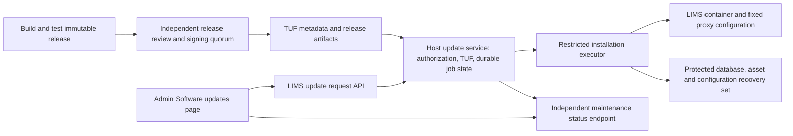

# SoilFER LIMS — secure updates from the admin panel

Implementation proposal, 25 September 2026. Repository inspected at `429ee38650ce094861a5c1cec8fcfced8d34343a`. Planning only: no application, deployment, credentials, permissions or production data changed. Existing PR145 work remains separate.

**Recommended outcome**

A designated, host-enrolled Super Admin opens **Administration → Software updates**, sees an authenticated release and its impact, downloads it while the laboratory continues working, and authorizes installation during a maintenance window. A separate host updater verifies the release, prepares recovery, performs the cutover, and reports success only after the installed software and data pass checks. An interrupted browser session does not interrupt installation.

Owner decision, 27 September 2026: update controls are reserved for `SUPER_ADMIN`. Lab managers and other roles cannot install updates, including on dedicated local installations. This is a planning decision only; it does not authorize implementation or change existing production permissions.

TUF authenticates update metadata and target files; it does not implement the installer, establish initial trust, or make migrations safe. Its protections include stale or inconsistent metadata detection, signature thresholds and key rotation. We should use an existing implementation rather than write cryptographic verification ourselves. [TUF specification](https://theupdateframework.github.io/specification/latest/), [Python reference implementation](https://github.com/theupdateframework/python-tuf).

Our design must additionally protect availability, database consistency, attachments, configuration, approval boundaries and recovery. It cannot guarantee safety after a host-root compromise or compromise of the required signing quorum, nor prove that correctly signed application code is bug-free.

**1. Both platforms in the first release**

User direction: **Linux and Windows must both ship in the first release.** This includes Windows-hosted laboratory installations, not merely Windows browsers. Proposed initial x86-64 profiles, subject to actual fleet inventory:

| Platform | Proposed supported runtime | Required first-release qualification |
|---|---|---|
| Linux | Named supported LTS distribution, Docker Engine + Compose, systemd updater | Unattended boot, fencing, backup/restore, disk exhaustion and power-loss recovery |
| Windows | Windows 11 Pro/Enterprise with Hyper-V; packaged Linux appliance VM containing the same Docker/Compose app and updater | Signed Windows bootstrap/recovery tooling, VM autostart without login, stable HTTPS/LAN access, Windows reboot/sleep/power interruption and backup recovery |

Microsoft documents Hyper-V support for Windows 11 Pro/Enterprise. This proposal uses a managed VM so the existing Linux container and verifier can be shared between platforms. Docker Desktop is not the production dependency; Docker also explicitly excludes Windows Server from Docker Desktop support. [Microsoft Hyper-V installation](https://learn.microsoft.com/en-us/windows-server/virtualization/hyper-v/get-started/install-hyper-v?pivots=windows&tabs=gui), [Docker Windows support](https://docs.docker.com/desktop/setup/install/windows-install/).

Windows edition, virtualization availability and memory/storage requirements must be checked during provisioning, with a clear unsupported-profile message. If the fleet needs Windows Home, Windows Server or existing WSL2 deployments, qualify that profile in increment0 and implement its required adapter before declaring the relevant labs supported. Do not silently count a remote Linux server as Windows-hosted support. ARM64 remains a separately qualified extension.

The Windows installer provisions a dedicated VM, pinned appliance image, fixed virtual networking/firewall configuration, HTTPS identity and protected data/trust disks. A narrowly scoped Windows service handles only that VM's lifecycle and recovery status using fixed operations; it exposes no remote arbitrary PowerShell or Hyper-V management endpoint. Persist lab SQLite and uploads on the guest's Linux filesystem, not a Windows shared folder. Recovery backups must also reach approved storage outside the VM's primary disk; a VM checkpoint alone is insufficient. Keep updater trust state independent of application/data snapshots and preserve its high-water marks through VM repair. Windows host/guest OS patching is a separate managed lifecycle; an ordinary LIMS update never upgrades Windows or replaces the appliance OS.

The first production increment supports manually initiated installation of releases that require **no schema migration**. Automatic checking and download are allowed; automatic installation is off. Later increments add compatible additive migrations, scheduled installation, and signed offline bundles. Destructive transformations stay assisted operations until explicitly supported and rehearsed.

Dedicated lab instances have their own installation identity. On dedicated and shared/global instances alike, only a Super Admin enrolled for that installation may operate its update controls; a tenant lab manager can view relevant status but cannot initiate an update. Enrollment for one installation does not authorize another. Local/global mode and installation ownership come from host provisioning, never a browser-supplied lab ID or mutable UI setting.

**2. What exists and what must change**

| Observed repository behavior | Required implementation |
|---|---|
| `docker-compose.yml` builds local source and mounts database, uploads and backup volumes. | Consume immutable published artifacts; keep volumes and instance configuration outside the image. |
| `docs/book/src/maintenance/updates.md` uses `git pull`, rebuild, restart and `HEAD~1` rollback. | Replace this guidance when the updater ships with an exact-version, journaled workflow and tested recovery. Volume persistence alone is not a recovery guarantee. |
| `docker-entrypoint.sh` runs three migration scripts automatically. | Add an updater-managed startup path that checks schema compatibility and refuses unplanned migrations; explicit migration execution belongs to the updater transaction. Bootstrap migrations remain an explicit installation operation. |
| `server/app.js` health returns process status and uptime. | Add authenticated readiness and version evidence: release ID, build/source identity, schema level, critical storage/dependency checks and maintenance state. Retain a minimal public liveness endpoint. |
| Existing backup script uses SQLite's backup API and rotates backups after 14 days. | Preserve that sound snapshot primitive, add restoration checks and a separate pinned update-backup retention class including assets/configuration. Normal rotation cannot delete active recovery material. |
| `AdminPanel.jsx`, `adminRoutes.js`, `authMiddleware.js` support server-validated principals and role permissions, including impersonation markers. | Add explicit installation-update authorization and independent host enrollment; disallow impersonated apply operations. Existing lab-management privileges are insufficient. |
| Recent release scripts quiesce writes, stop writers, back up and perform postflight checks, but hardcode host paths, proxy details and data counts. | Turn the successful operational sequence into a reusable state machine with a per-installation adapter and measured invariants. Do not execute these scripts verbatim from the web app. |

Reference files are relative to the repository root. This is an inventory of source behavior, not a new production audit.

**3. Architecture and trust boundaries**

Proposed implementation: a Python host service using `tuf.ngclient.Updater`, a small fixed-operation executor, and the existing React/Express application as the user interface. Pin and package the Python runtime and dependencies in the host installer; no `pip install` or source compilation during each lab update. `ngclient` supplies the complete TUF client workflow. [Client API](https://theupdateframework.readthedocs.io/en/stable/api/tuf.ngclient.html).

On Windows this service runs inside the managed appliance VM. The Windows lifecycle service and installer are separate, Authenticode-signed artifacts, with a narrowly documented local privileged bootstrap. The release manifest distinguishes the physical host profile from the Linux application-image platform; neither should be guessed from a browser user agent.

The web container gets **no Docker socket, sudo, SSH private key, host filesystem mount, or generic command endpoint**. The host service independently verifies every selected release and reads host-owned policy. A private Unix socket exposes typed operations, authenticated caller identity and strict schemas. It accepts a verified release ID and job ID, never shell text, arbitrary URLs, image names, paths, mounts, proxy configuration or environment variables.

Use fixed executable argument arrays; prohibit shell interpolation. A narrow executor accepts only known installation IDs, verified artifact handles and enumerated actions. Any access to the Docker daemon remains highly privileged: reducing the API surface and service privileges limits risk but does not turn Docker control into an unprivileged capability. [Docker security guidance](https://docs.docker.com/engine/security/protect-access/).

Host-owned state lives outside the app/database volumes: trusted metadata, highest accepted metadata/release versions, enrollment, instance policy, transaction journal, staged artifacts and audit records. The app cannot rewrite this state. Metadata state is persisted atomically; database restoration must never roll back updater trust state.

**4. Publishing, signing and bootstrap**

Build once from a reviewed commit in protected CI, with locked dependencies and pinned base-image digests. Publish an OCI image archive as an exact TUF target for v1; this keeps download verification and later offline transport straightforward. Bind the archive hash/length and expected OCI manifest/config digests in a signed release manifest. Load only the verified archive and start the exact imported image identity, never a mutable tag. Registry-native digest pulls can be added later with equivalent binding and verification.

Publish an SBOM, test results, migration compatibility report and provenance that identifies the source commit, builder identity and output digest. A provenance file that merely repeats a commit string is insufficient. Verify the attestation's trusted producer and subject digest before release signing. Independent review is still necessary when CI is compromised; do not claim a SLSA level without satisfying its requirements. [SLSA provenance](https://slsa.dev/spec/v1.2/provenance).

Proposed signing policy and initial operating values (subject to a key-operations review):

| Role | Proposed custody and approval | Initial validity/operations |
|---|---|---|
| Root | 2-of-3 separately held offline/hardware-backed keys; never in CI or labs | 12 months; planned rotation well before expiry, published version chain |
| Top-level targets | 2-of-3 offline keys; controls delegated namespaces | 90 days; scheduled renewal |
| Stable application releases | 2-of-3 separate human-controlled signing keys, not unattended CI credentials | 90 days; signs exact reviewed bytes |
| Updater releases | Separate threshold delegation and reviewers | Separate lifecycle from application updates |
| Snapshot | Dedicated protected automation key | 7 days; refresh on publication |
| Timestamp | Separate online key in managed signing service | 24 hours; refresh every 6 hours with expiry alarms |

Use consistent snapshots and publish artifact bytes and versioned metadata before timestamp. Stable and pilot namespaces cannot authorize each other's releases. Root updates follow the library's sequential verification and old/new signing thresholds; root replacement must not be a button that accepts an uploaded key. Monitor renewal and rehearse key compromise/loss. [TUF repository and client rules](https://theupdateframework.github.io/specification/latest/).

The initial host installer embeds an independently authenticated root and repository identity. Existing installations need one supervised provisioning step to verify and install the updater, enroll the installation, register its first update operator and validate recovery storage. Trust-on-first-download from the update endpoint is not acceptable. This initial privileged installation is distinct from later administrator-driven app updates.

Existing deployments first receive a reviewed bridge release that provides the update panel, controlled startup and readiness protocol. Record an independently verified baseline image/schema/configuration during enrollment; unknown or locally modified images require assessment before automated updates are enabled. Moving an existing Windows installation into the managed appliance requires a separately verified DB/assets/configuration transfer and recovery rehearsal, with no change to country, lab membership, Kobo provenance or historical results. Do not let first enrollment silently import an arbitrary database or treat a mutable image tag as a trusted baseline.

Updater and Windows lifecycle-service upgrades use their separate signed target delegation, protocol compatibility checks and an external supervisor capable of restoring the last trusted service binary. The ordinary application installer cannot modify its verifier or trusted root. Qualify this recovery path before enabling updater self-update; initial service upgrades may use the signed supervised installer while app updates remain available through the panel.

**5. Release manifest and compatibility policy**

The signed manifest includes: manifest format version; product ID; unique release ID and monotonic release sequence; human version; source commit; OS/architecture; archive target path/hash/length; OCI identities; allowed deployment profiles; minimum updater version; allowed source releases; schema before/after and supported read/write range; migration IDs/hashes; rollback compatibility; backup/storage requirements; release-note target; SBOM/provenance targets; and revocation/rollout policy references.

Validate it with a closed schema and explicit version handling. A valid signature alone does not authorize a wrong platform, product, channel or schema. Locally configured policy may be stricter than the manifest; the manifest cannot grant new host capabilities. No executable installation script supplied through custom metadata. Migration code must be part of the verified release, invoked through a fixed interface without host Docker access or unrelated mounts.

Select updates using signed release policy plus locally persisted highest accepted sequence. Revalidate freshness, withdrawal/revocation and compatibility immediately before installation, including after staging or scheduling delays. The displayed version must come from verified manifest data and installed identity, not a build-time label alone.

**6. Administrator journey and authorization**

Display installed version, available stable release, release notes, download size, estimated downtime, last verified backup, migration impact, compatibility, last successful check and any actionable block. An unavailable update server must say “Updates unavailable”; it must not say “Up to date.”

The journey is **Check → Download and verify → Review readiness → Authorize maintenance → Install → Verify → Resume laboratory work**. Show a single clear installation confirmation with impact and recovery readiness. Ordinary installations should not require a shell or repeated approvals. Show “Do not power off this server” only during the actual critical window, and provide a durable job ID and downloadable redacted support report.

Design proposed permissions `VIEW_SOFTWARE_UPDATES` and `REQUEST_SOFTWARE_UPDATE` plus host-side enrollment for installation operators. Enforce `SUPER_ADMIN` as a required server-side role for manual check, stage, authorization and apply controls; a permission grant alone must not bypass this role restriction. Lab managers may receive read-only version, maintenance and update status. Deny update mutations for all other roles, including `LAB_MANAGER` and `MASTER_USER`, even on dedicated instances. Super Admin status alone does not enroll a principal with the host: apply additionally requires installation-specific enrollment and the independent assertion below. Model the policy in development; provisioning must not automatically enroll all existing Super Admins or reconcile unrelated memberships. Revocation of the role or host enrollment must prevent new apply authorizations.

For apply, require recent authentication and an independently verified operator assertion: preferably WebAuthn with user verification, whose public credential and installation binding are enrolled in host-owned state. The host issues a short-lived, single-use challenge bound to installation, release digest, maintenance window and job nonce; verifies origin/RP ID and enrollment itself; and rejects replay or a different release. App JWT validation alone cannot protect host authorization if the web app or its signing secret is compromised. WebAuthn does not prevent a fully compromised UI from misleading a user; fixed host policy, release signing and bounded maintenance windows remain necessary.

Same-origin protections, appropriate CSRF protection for the chosen session transport, rate limits, fresh principal validation and explicit impersonation denial apply to all mutation routes. A compromised administrator may still interrupt service within their permitted maintenance scope; no claim that TUF prevents this.

Suggested HTTP surface: `GET /api/admin/software-updates/status`, `POST .../check`, `POST .../stage`, `POST .../authorize-challenge`, `POST .../apply`, and `GET .../jobs/:id`. Apply returns 202 with a durable job ID. Mutations require idempotency keys; duplicate clicks return the same job; concurrent updates are rejected. Cancel is available only before the critical cutover.

The proxy serves a small maintenance/status page independently of LIMS. A job-specific, short-lived read-only capability allows progress viewing during restart without exposing an unauthenticated privileged agent API. Browser reload resumes polling; no sensitive logs, tokens or backup paths appear there.

**7. Transaction, data safety and crash recovery**

Persist each transition before side effects, then reconcile its observed result after restart:

`IDLE → CHECKING → VERIFIED → STAGED → PREFLIGHT_OK → QUIESCING → BACKUP_VERIFIED → MIGRATING(optional) → STARTING → VERIFYING → COMMITTING → COMPLETE`

Failures enter `ABORTED`, `ROLLING_BACK`, `RECOVERED` or `RECOVERY_REQUIRED`. Durable intent/result records and one installation lock make operations retryable. Inject power loss at every transition during qualification.

1. **Stage without downtime:** verify metadata and size limits, download with bounded resources, verify target bytes, import exact image, check free disk for image + working copy + database/assets recovery + margin. Hash again immediately before use; protect files against symlink/path substitution and concurrent replacement.
2. **Preflight:** establish current image, schema, configured volumes, available backup capacity, operator enrollment and maintenance authorization. Refuse unexpected configuration drift, unsupported schema or incomplete previous jobs. Exclude unregistered writers and competing manual deployment operations.
3. **Fence all writes:** apply maintenance handling, drain in-flight work and websocket mutations, then stop the app and all worker containers/services with database or attachment access. Blocking HTTP verbs alone is insufficient. Stop background Kobo/sync/scheduler writers without deleting their configuration or disconnecting their mappings. Never run old and new writers concurrently.
4. **Create the recovery set:** consistent SQLite backup plus matching attachment snapshot/inventory, configuration, secret references, image IDs, schema and journal boundary. Pin it outside normal rotation; protect it from the app, encrypt it and test key availability. Integrity/FK checks, hashes and opening a restored copy are mandatory. Qualify end-to-end restoration on disposable copies. The SQLite backup API provides a consistent database snapshot; it does not automatically coordinate separately stored attachments. [SQLite backup](https://www.sqlite.org/backup.html), [WAL](https://www.sqlite.org/wal.html).
5. **Migrate only when enabled:** v1 rejects schema-changing manifests. Later, rehearse approved migration IDs against a private snapshot first, then run once against the fenced database with a transactional/idempotent ledger. Refuse destructive or unrecognized transformations. Never call `prisma db push` or seed as part of a managed update.
6. **Start under maintenance:** use the verified image, existing secret/configuration references and suppressed schedulers. Startup must not run unplanned migration scripts. Check exact running identity, DB compatibility, critical read-only role/route behavior and asset compatibility. Do not inject synthetic production records to test success.
7. **Commit and resume:** record installed identity and migration results, verify readiness, remove maintenance, enable normal writers and check their configured state. Browser assets use immutable names and a version handshake to avoid stale client requests. Completion means service is ready and maintenance is cleared, not merely HTTP200.

Rollback is an **installer policy**, separate from TUF metadata anti-rollback. Retain the exact last healthy image and a transaction-scoped recovery authorization bound to its digest, data state and deadline. Never lower stored TUF versions or delete trust state to force a downgrade. Outside that narrowly authorized failed transaction, an older application requires a fresh signed recovery release/policy and operator authorization.

Before new writes resume, automatically restore the prior image and, only if needed, the verified matching DB/assets recovery set. Keep the failed state for diagnosis. After new work has been accepted, never automatically restore an old database: it would erase laboratory work. Compatible application-only rollback may be allowed; otherwise enter protected maintenance and use an assisted recovery/forward fix. If rollback fails, leave maintenance in place and expose host-side recovery instructions; do not loop between images.

**8. Connectivity and long-lived installations**

Download retries and resumable staging must tolerate poor connections; verified artifacts stay cached. Expired metadata or a suspicious clock blocks a new update, not existing laboratory operation. Preserve a last-observed time floor, detect backward clock changes and monitor host time synchronization; this does not solve malicious host time or missing real-time-clock hardware. A clock failure needs a documented local repair path, not “ignore expiry.”

Offline phase: import signed bundles containing targets, required metadata and any sequential root updates. Verify them with the same client and host policy. Removable media is an untrusted transport. Normal expiry remains enforced; long-disconnected labs need a deliberately designed signing/freshness operating policy and current bundles, not a universal bypass. Resume normal use of the installed version when no fresh bundle is available.

Update polling sends no samples, patient/farmer details, results, Kobo payloads or credentials. Optional fleet health telemetry is limited to installation/update status under an explicit policy. The updater must not couple normal lab operation to Kobo or to a permanent central connection.

**9. Delivery sequence and release gates**

| Increment | Concrete deliverables | Exit evidence |
|---|---|---|
| 0 — contract and threat model | Linux and Windows fleet profiles, ownership/enrollment rules, manifest schema, failure states, key custodian runbook; test machines with realistic DB/assets | Both first-release profiles and recovery objectives agreed; no ambiguous tenant-to-host authority |
| 1 — trusted distribution and bootstrap | Protected image build/publication, signing process, TUF repository, pinned bootstrap root, verifier CLI, Linux package and signed Windows appliance installer | Tamper, expiry, rollback, mismatched metadata, key rotation and wrong-platform tests reject correctly; bootstrap works on both platforms |
| 2 — read-only integration | Host daemon, protected state/journal, version/readiness endpoint, status/check/stage APIs and admin page | Unauthorized/impersonated users denied; no Docker capability in app; interrupted download and browser reload safe |
| 3 — installation authorization | Host enrollment, WebAuthn challenge verification, job idempotency, maintenance/status proxy adapter | Replay/cross-instance/cross-release approval tests fail; shared-host tenant restrictions enforced |
| 4 — no-migration installer on both platforms | Fencing, DB/assets backup verification, exact-image replacement, postflight, automatic pre-resume recovery; Windows VM/lifecycle integration | Process/power/disk/network failure matrix passes on Linux and Windows; no lost committed data; restores demonstrated on each target |
| 5 — dual-platform pilot and operations | Internal Linux and Windows instances, then a designated pilot lab for each; release withdrawal, key-loss drill, support exports, operational docs | Both pilots pass upgrade, forced failure recovery, expired-metadata exercise and clean return to normal lab work; first release waits for both |
| 6 — extensions | Additive migration adapter, signed offline bundles, ARM64/additional OS profiles, scheduling | Separate qualification for each capability; no inherited safety claim from either first-release pilot |

Implement as small PRs with the updater disabled by default until the relevant gate passes. Agy can implement after this plan is adopted; independent review owns acceptance. Do not insert this work into the active reception PR. Finish the existing review/release separately.

**10. Mandatory adversarial and recovery tests**

Test corrupted, truncated and oversized metadata/artifacts; wrong keys, insufficient threshold and invalid root rotation; expired timestamp and replayed snapshot; mismatched target hash/length; cross-channel/product/architecture substitution; revoked releases staged before withdrawal; archive traversal/symlinks/decompression exhaustion; downloaded-file substitution before import; and malicious manifest fields seeking arbitrary Docker/host capabilities.

Test stolen/replayed approval, impersonation, revoked enrollment, forged lab ID, duplicate requests, concurrent manual deployment, stale browser assets and outdated updater protocol. Verify that non-Super Admin roles cannot invoke update mutations even with a stray update permission, an unenrolled Super Admin cannot apply, and enrollment for another installation is rejected. Test role and enrollment revocation before new apply authorization. Simulate app compromise: it must not choose arbitrary host commands, artifacts, enrollment or trust roots, even if its own JWT secret is known.

Test crashes/reboots before and after each durable transition, failed WAL checkpoint, corrupt backup, full disk, missing encryption key, attachment restoration mismatch, failed startup/readiness, stuck worker, partial migration, rollback failure, and post-resume writes. Prove that trust-state high-water marks survive application/data rollback. Use disposable data only; never mutate production to certify updater safety.

On Windows additionally test cold boot without interactive login, Windows Update reboot, suspend/resume, guest freeze/crash, missing virtual disk, VM autostart failure, antivirus quarantine of staging files, host/guest time disagreement and changed network address. Verify backup recovery to a replacement Windows host and denial of access from an unrelated local Windows user. On Linux verify equivalent restart recovery, service account permissions and fixed proxy configuration. Both matrices are first-release gates.

Release acceptance requires: current-source/artifact identity tied to test evidence; independent security review of TUF integration, privileged executor and Windows wrapper; end-to-end failure recovery on both supported lab profiles; and an operator walkthrough from the admin panel on Linux and Windows. “All unit tests pass” alone is insufficient.

**11. Decisions to settle before implementation gates**

Linux and Windows are mandatory for the first release. Confirm exact Windows editions/Linux distributions, dedicated versus shared hosts, maintenance windows and maximum acceptable downtime; nominate signing custodians and initial installation operators; choose durable encrypted recovery storage and retention; choose release hosting/mirrors and key service; and agree how often offline laboratories can receive fresh metadata. These decisions do not require stopping the design work or changing any existing production grants.

A separately authenticated host updater adds packaging, key operations, host enrollment and disaster recovery work. The first deliverable is a testable no-migration update on disposable Linux and Windows installations, followed by controlled pilots on both.

**12. Proposed code ownership and package boundaries**

These are planned new files/packages, not changes already implemented:

| Area | Proposed location | Responsibility |
|---|---|---|
| Host verifier and job service | `updater/agent/` | TUF client adapter, manifest policy, enrollment/challenge verification, durable jobs and status |
| Restricted installation operations | `updater/executor/` | Fixed container, proxy, backup and recovery actions |
| Linux provisioning | `updater/platforms/linux/` | systemd units, packages, filesystem/socket ownership and recovery CLI |
| Windows provisioning | `updater/platforms/windows/` | Signed installer/lifecycle service, appliance provisioning, fixed Hyper-V adapter and recovery UI |
| Publishing | `release/tuf/` and protected `.github/workflows/release.yml` | Reproducible artifact identity, attestation verification, metadata publication and signing workflow |
| Web API | `server/routes/softwareUpdateRoutes.js`, `server/services/softwareUpdateService.js` | Existing-principal checks and typed agent communication, no shell/Docker execution |
| Administrator UI | `client/src/components/admin/SoftwareUpdates.jsx`, integration in `AdminPanel.jsx` | Verified status, impact, staging, approval and durable progress |
| Startup/readiness | `docker-entrypoint.sh`, `server/app.js`, dedicated maintenance/readiness service | Explicit migration ownership, release identity and writer fencing |
| Qualification | `updater/tests/`, `tests/update-e2e/` | Hostile repository fixtures, both platform fault matrices and independent acceptance evidence |

Use one versioned protocol/schema package between Express, agent and platform adapters. Keep update job truth outside the LIMS database; append a redacted audit summary back into LIMS when available. Do not hold a web request open for the installation or require the app database to be writable for crash recovery.
