# OpenNSIS Connector Mapping & Joint Acceptance Protocol

**Document Version:** 1.0.0  
**Target Systems:** FAO OpenNSIS (`sis-database/owl2sql`), National Soil Information Systems (NSIS), SoilFER-LIMS  
**Governing Issue:** GitHub Issue [#140](https://github.com/yigini/soilfer-lims/issues/140) (Packages P5 & P7 Handoff)  
**Status:** Review-Ready Specification & Handoff Agreement  

---

## 1. System Boundaries & Ownership Delineation

To maintain data integrity and clear institutional accountability, the responsibilities between SoilFER-LIMS and OpenNSIS are strictly bounded:

```mermaid
flowchart LR
    subgraph SoilFER_LIMS["SoilFER-LIMS (Laboratory Domain)"]
        A[Field Intake & Kobo] --> B[Laboratory Reception & Accession]
        B --> C[Wet Chemistry & Spectroscopy]
        C --> D[QA/QC & Section Approval]
        D --> E[V2 Data Exchange Gateway]
    end

    subgraph OpenNSIS["OpenNSIS (National Domain)"]
        F[National Soil Registry]
        G[Spatial Reconciliation & Pedology]
        H[Soil Property Grids & Pedotransfer]
        I[National GIS & FAO Portal]
    end

    E -->|"TLS HTTPS (JSON/GeoJSON)"| F
    F --> G --> H --> I
    F -.->|"Delivery Receipts (Audit)"| E
```

### Ownership Invariants:
1. **SoilFER-LIMS owns:**
   - Physical specimen intake, barcode tracking, and laboratory accessioning (`labId`).
   - Analytical chemistry determinations, instrument replicates, moisture basis, and ISO methodology references.
   - Lossless publication gateway (`/api/v2/data-exchange`) enforcing fail-closed scoping and publication invariants (`status IN ('APPROVED', 'RELEASED')`).
   - Durable export snapshots and monotonic continuous change feed.
2. **OpenNSIS owns:**
   - National soil profile taxonomy, genetic horizon designations, and morphological site descriptions.
   - Spatial reconciliation, cadastral validation, and territorial GIS overlay.
   - Harmonization across multiple laboratory nodes and ingestion into national soil database tables (`owl2sql`).
   - Sending delivery receipts back to LIMS upon batch ingestion.
3. **Explicit Prohibition:**
   Neither system shall claim receiver ingestion or complete synchronization without cryptographically verified delivery receipt logs.

---

## 2. Source-to-Target Field Mapping Guide

### 2.1 Specimen Registry Mapping (`GET /api/v2/data-exchange/samples`)

| SoilFER-LIMS V2 Field | OpenNSIS Target Table / Column | Datatype | Conversion & Semantic Rules |
|---|---|---|---|
| `specimenId` | `soil_specimen.external_specimen_uuid` | UUID / String | Unique primary key identifying the physical soil jar/specimen in LIMS. |
| `fieldSampleId` (`originalId`) | `soil_specimen.field_sample_code` | String (nullable) | Field sample identifier recorded by collectors on intake bags. |
| `labSampleId` (`labId`) | `soil_specimen.lab_accession_number` | String (nullable) | Official laboratory accession sequence. Mandated when `profile=opennsis`. |
| `sourceSystemId` | `soil_specimen.source_system_identifier` | String | Fixed string: `soilfer-lims-core`. |
| `laboratoryId` (`assignedLab`) | `soil_specimen.testing_laboratory_id` | String | Code of the analyzing laboratory (e.g., `GTM-LAB1`, `KEN-LAB1`). |
| `country` | `soil_specimen.country_iso3` | CHAR(3) | ISO 3166-1 alpha-3 code (e.g. `KEN`, `GTM`). |
| `matrix` | `soil_specimen.specimen_matrix` | String | Material matrix: `SOIL`, `PLANT`, `WATER`, or `FERTILIZER`. |
| `status` | `soil_specimen.source_qc_status` | String | Strictly `APPROVED` or `RELEASED`. |
| `spatial.coordinates[0]` | `site_location.longitude` | Float (WGS84) | Longitude in decimal degrees (-180.0 to 180.0). Preserves 0.0 without drop. |
| `spatial.coordinates[1]` | `site_location.latitude` | Float (WGS84) | Latitude in decimal degrees (-90.0 to 90.0). Preserves 0.0 without drop. |
| `spatial.coordinates[2]` | `site_location.elevation_meters` | Float (nullable) | Elevation above sea level in meters. |
| `depth.topCm` | `specimen_layer.depth_upper_cm` | Numeric(5,2) | Top horizon depth. Float preserved (e.g., `0.0`). Null if not recorded. |
| `depth.bottomCm` | `specimen_layer.depth_lower_cm` | Numeric(5,2) | Bottom horizon depth. Float preserved (e.g., `15.5`). Null if not recorded. |
| `depth.horizon` | `specimen_layer.horizon_designation` | String (nullable) | Genetic or morphological horizon (e.g., `Ap`, `Bt1`). |
| `temporal.collectionDate` | `field_observation.sampling_date` | Date (ISO 8601) | Date collected in the field (YYYY-MM-DD). Null if omitted. |
| `temporal.receptionTimestamp` | `soil_specimen.lab_reception_timestamp` | Timestamp | Timestamp when specimen physically arrived at the laboratory. |
| `profile.namespace` | `soil_profile.profile_namespace` | String | Project code or country territory (e.g. `SOILFER-GTM`). |
| `profile.code` | `soil_profile.local_profile_code` | String (nullable) | Site / plot / profile identifier (e.g. `PLOT-ALPHA`). |
| `profile.resolvedKey` | `soil_profile.national_profile_key` | String (nullable) | Deterministic composite key: `{namespace}:{code}`. |

---

### 2.2 Analytical Observations Matrix Mapping (`GET /api/v2/data-exchange/observations`)

| SoilFER-LIMS V2 Field | OpenNSIS Target Table / Column | Datatype | Conversion & Semantic Rules |
|---|---|---|---|
| `observationId` | `analytical_determination.determination_id` | String | Unique determination identifier. |
| `specimenId` | `analytical_determination.specimen_uuid` | UUID / String | Foreign key to `soil_specimen.external_specimen_uuid`. |
| `analyte.code` | `analytical_determination.property_code` | String | Controlled analyte code (e.g., `PH_H2O`, `SOC_WALKLEY_BLACK`). |
| `analyte.procedureUri` | `analytical_determination.glosis_procedure_uri` | URI | GloSIS ontology procedure URI (e.g., `https://w3id.org/glosis/model/procedure/pH_H2O_1_2.5`). |
| `asMeasured.value` | `analytical_determination.raw_numerical_value` | Float | Unrounded raw measured numerical value. |
| `asMeasured.rawValue` | `analytical_determination.raw_text_value` | String | Exact verbatim character output from instrument (e.g. `"6.40"`). |
| `asMeasured.unit` | `analytical_determination.raw_unit` | String | Laboratory local unit (e.g., `pH_units`, `%`). |
| `normalized.value` | `analytical_determination.standard_value` | Float | Harmonized standard numerical value (e.g., SOC in `g/kg`). |
| `normalized.unit` | `analytical_determination.standard_unit` | String | Controlled standard unit. |
| `normalized.qudtUri` | `analytical_determination.qudt_unit_uri` | URI | QUDT vocabulary URI (e.g., `http://qudt.org/vocab/unit/PH`). |
| `metrology.replicateNo` | `analytical_determination.replicate_index` | Integer | Replicate sequence number (1, 2, ...). Prevents analyte clobbering. |
| `metrology.basis` | `analytical_determination.moisture_basis` | Enum | Analytical basis (`AIR_DRY`, `OVEN_DRY_105`, `AS_RECEIVED`). |
| `metrology.censoring` | `analytical_determination.censoring_flag` | Enum | Censoring indicator (`NONE`, `LT_LOD`, `GT_ULOD`). |
| `metrology.lod` | `analytical_determination.limit_of_detection` | Float (nullable) | Limit of Detection. |
| `metrology.loq` | `analytical_determination.limit_of_quantitation` | Float (nullable) | Limit of Quantitation. |
| `method.id` | `analytical_determination.lab_method_code` | String | Laboratory methodology code. |
| `method.isoStandard` | `analytical_determination.standard_reference` | String | ISO / standard reference (e.g., `ISO 10390:2021`). |
| `determinedAt` | `analytical_determination.analysis_timestamp` | Timestamp | Timestamp when determination was executed. |

---

## 3. Critical Technical Rules for Connector Implementers

### 3.1 Strict Preservation of Decimal Depths
- **Never round decimal depth horizons:** Depths such as `0.0 – 15.5 cm` must be preserved as decimal numbers.
- In OpenNSIS database schemas (`owl2sql`), use `NUMERIC(5,2)` or `DOUBLE PRECISION` for upper and lower horizon depths.
- **Never substitute missing depths with default 0–20 cm:** If `topCm` or `bottomCm` is `null`, store `NULL` in the OpenNSIS database. Substituting a synthetic default distorts national digital soil mapping (DSM) depth functions.

### 3.2 Distinguishing Collection Date from Lab Reception Date
- `temporal.collectionDate` represents field collection by extension agents or agronomists.
- `temporal.receptionTimestamp` represents the physical intake time at the lab specimen reception desk.
- Do not overwrite `sampling_date` with `reception_timestamp` or vice versa.

### 3.3 Handling Replicate Determinations
- When laboratories perform duplicate or triplicate determinations on the same specimen, LIMS V2 emits separate records in `observations[]`, each with a distinct `metrology.replicateNo` (`1`, `2`, ...).
- The OpenNSIS connector must store each replicate as a distinct determination row. Do not average or overwrite replicate measurements during the extraction phase; harmonized averaging may occur later in national pedotransfer pipelines if desired.

### 3.4 Strict OpenNSIS Profile (`?profile=opennsis`)
- When querying `GET /api/v2/data-exchange/samples`, pass `?profile=opennsis`.
- This ensures that only specimens possessing an official laboratory accession identifier (`labId`) are returned. Specimen records lacking lab accession numbers are safely filtered out, preventing downstream foreign key issues.

---

## 4. Joint Pilot Acceptance Protocol (P5 / P7)

This four-stage acceptance protocol governs the transition from standalone testing to production synchronization between SoilFER-LIMS and an OpenNSIS national instance:

### Stage 1: Contract & Reference Client Verification (LIMS Side)
- **Executor:** LIMS Administrator / Automated CI
- **Procedure:** Run `node server/scripts/data_exchange_reference_client.cjs --verify`
- **Pass Criteria:** All 10 contract checks pass with exit code 0.

### Stage 2: Sandbox & Credential Provisioning
- **Executor:** Joint (LIMS Administrator + National NSIS Lead)
- **Procedure:**
  1. LIMS administrator provisions an API key with explicit country and lab scopes (e.g. `GTM-LAB1`).
  2. OpenNSIS team tests connectivity using the interactive **Live API Sandbox** in LIMS Admin UI (`/admin/api-keys`).
  3. Verify that `/capabilities` returns `supportedProfiles: ["opennsis", "glosis", "default"]`.

### Stage 3: Initial Snapshot Harvest & Reconciliation
- **Executor:** OpenNSIS Harvester
- **Procedure:**
  1. OpenNSIS creates a baseline snapshot: `POST /api/v2/data-exchange/snapshots` with body `{ "profile": "opennsis", "pageSize": 100 }`.
  2. OpenNSIS reads all snapshot pages sequentially via `GET /api/v2/data-exchange/snapshots/{id}/pages`.
  3. Validate that total specimens ingested matches `totalItems` reported in snapshot metadata.
  4. Submit an initial delivery receipt: `POST /api/v2/data-exchange/receipts`.

### Stage 4: Continuous Synchronization & Receipt Loop
- **Executor:** OpenNSIS Automated Cron Harvester
- **Procedure:**
  1. Periodically query `GET /api/v2/data-exchange/changes?cursor={last_cursor}`.
  2. Apply `PUBLICATION` events into the national database.
  3. Post an acknowledgement receipt back to LIMS with updated batch counts.
  4. If HTTP 410 (`CURSOR_EXPIRED`) is encountered, trigger automatic re-baselining via Stage 3.
- **Pass Criteria:** Zero manual intervention required for 14 continuous operating days during pilot testing.
